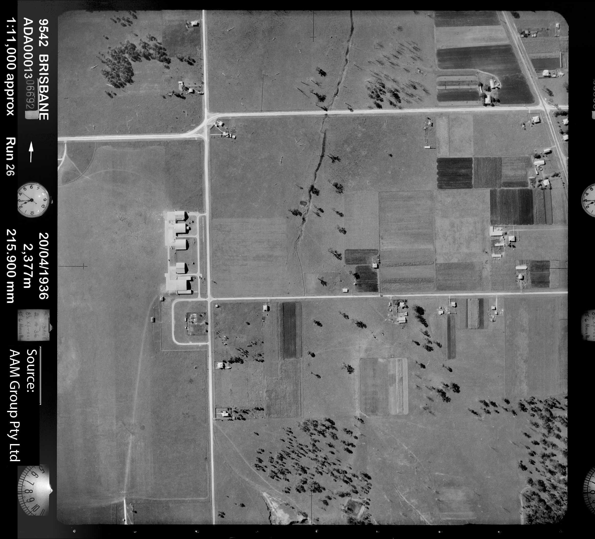
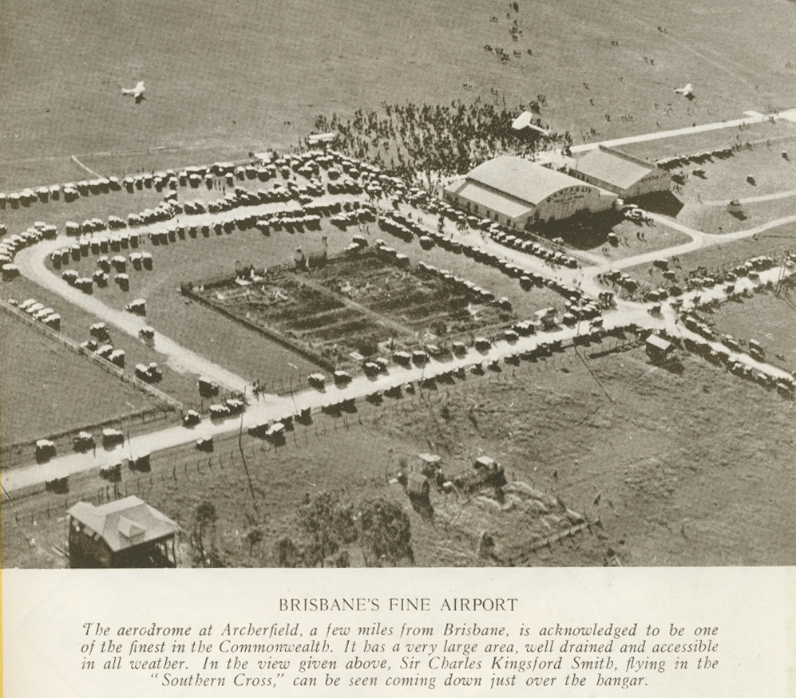
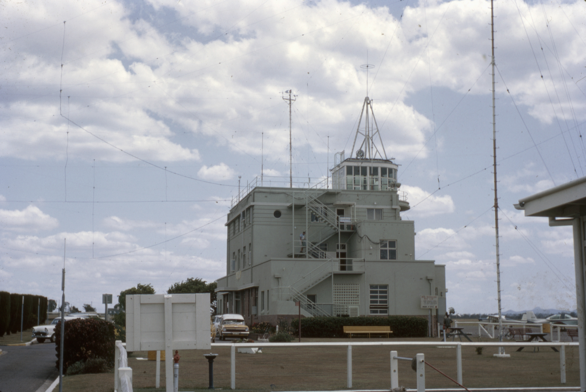
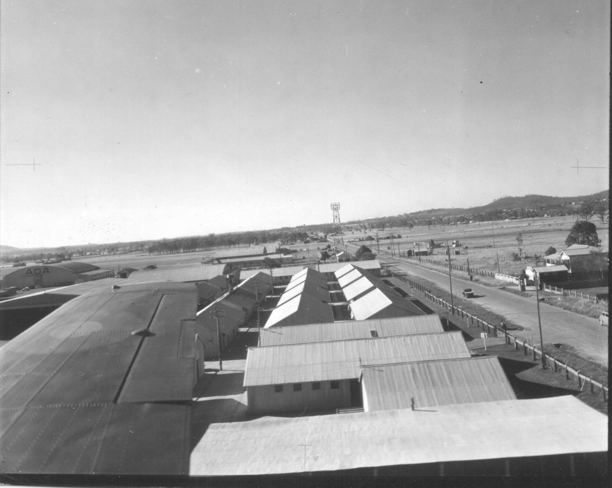
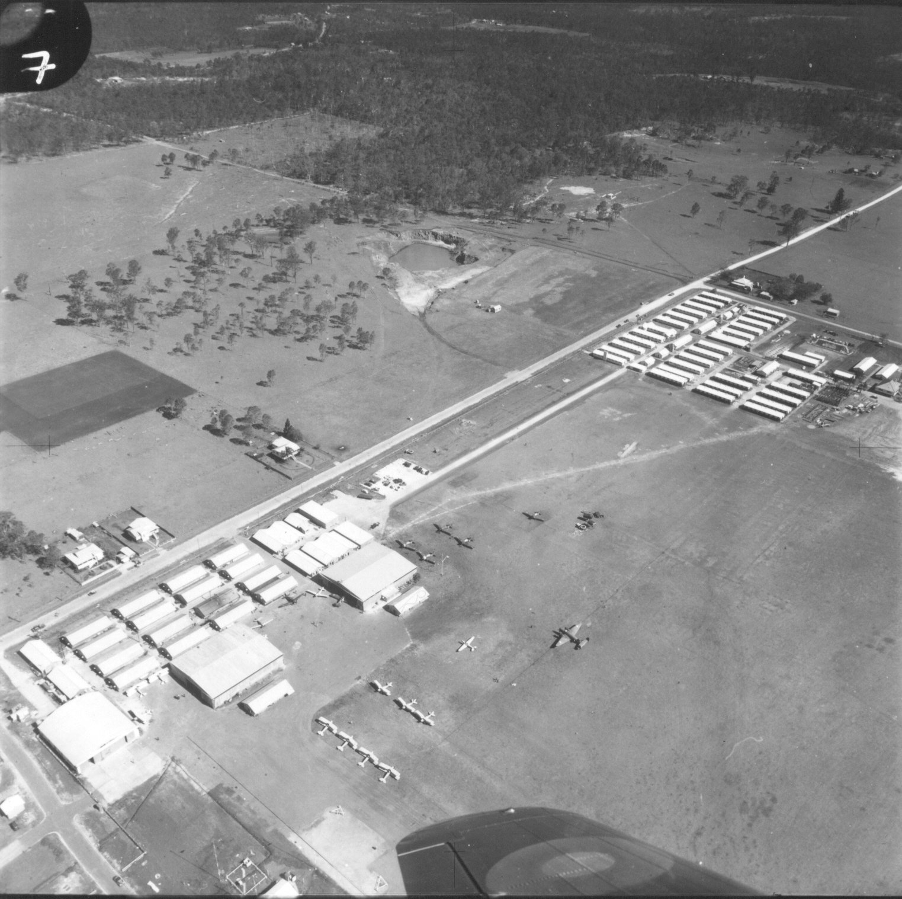
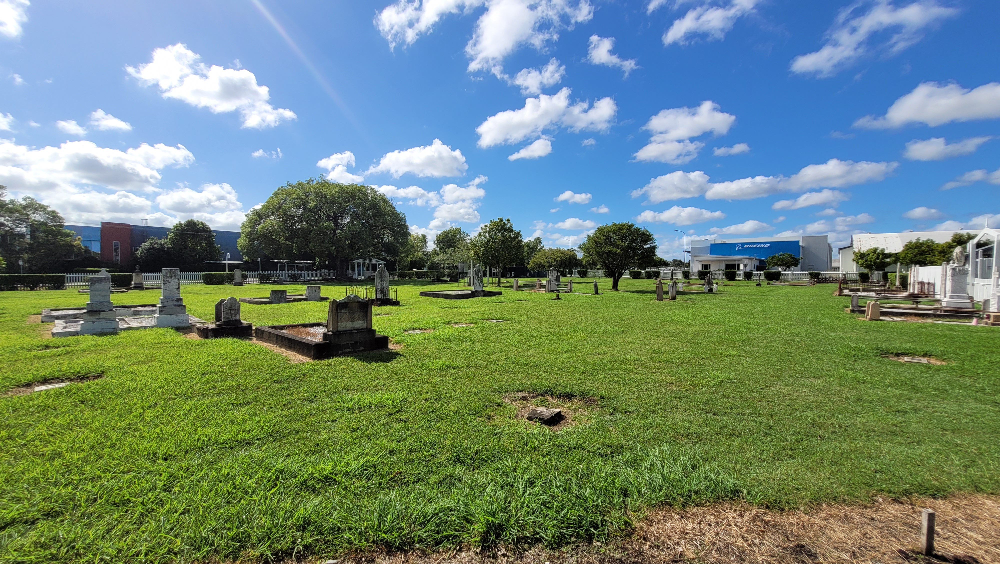

---
---
---

## Task 2 - Historical Image Analysis

The internet has allowed the consolidation of information from previously disparate sources. As
a result, photographs from different collections and repositories are easily accessible.

As a part of the research question, photographs of Archerfield are predominately thematic to the
airport, and consequently, most of the photographs selected for analysis are centered around the architectural, and developmental nature of the airfield. Secondarily, social aspects and juxtapositions of the past with the present in the framework of airfield security and operations are reflected in the imagery.
Consequently, the structured reflection of these images will be observed in the following questions:

1.  Why do you think this image was taken?

2.  What objects or physical features are in the
    image? This might be technical attributes (e.g. architectural features),
    historic objects (a vase, a vehicle) or even built features.

3.  Where was the photographer standing? How would
    the image change if the photographer was standing in a different position?
    (This question was chosen due to the unique quality that select photographs were
    taken aerially. )

4.  What meaning do you think the photographer was
    aiming to convey?

5.  What insights does this image provide on the
    past that we would not have without it?

All images have had their metadata changed to reflect the relevant details, and the text of the
initial reflection, and structured reflection, are embedded into the notes of the original files in Zotero.

#### Aerial Survey of Archerfield

*Source: [QImagery](http://qimagery.qld.gov.au)*

##### Initial Reflection

This image is limited by the fact it does not show the actual aerodrome (left of image) but does show the main aircraft hangars, and the cemetery. Further, the general feel of Archerfield in the 1930s is very apparent - agricultural, sparsely populated and occupied.

##### Structured Reflection

Aerial surveys of infrastructure and assets have been important to Queensland, and are recorded in the digital repository QImagery. While this series was designed to survey the entirety of Brisbane, it allows insight into the landscape of the city, including key infrastructure. The photograph captures the sparse landscape that abuts the eastern perimeter of the airfield, but also the agricultural holdings on nearby Beaudesert Road. In this circumstance, the camera was affixed to an aircraft and pursued multiple 'runs' across the city. Photographs of this nature assist in reconstructing the urban layout of a city, but also the types of farming, or cropping, that may have been operating in the area prior to urbanisation.

#### Brisbane's Fine Airport

*Source:* [Queensland Places](https://queenslandplaces.com.au/exhibit/book/ps388)

##### Initial Reflection

The aerodrome in its infancy, and the cemetery visible in the centre. Considerable differences to the modern era are apparent in the social construct: the crowd is not only on the tarmac, but surrounding the aircraft.

##### Structured Reflection

The dating of this, based off the subtitle, implies a 1934 recording. In the centre of the photograph is God's Acre Cemetery, and the attending crowd is witnessing Charles Kingsford Smith's landing.  This photo was most likely taken from another aircraft, looking northwest across the airfield. Had it been taken on any other angle, it would have captured the airport or the surrounding lands, but completely omit the moment being experienced. Evidently, Smith's popularity and the attention given to his flying is captured with the amount of vehicles, and people present at the time. Also, the cemetery is well disclosed, and certain gravestones are quite visible in the contrast of the fencing greenery.

#### Control Tower at Archerfield Airport, 1964

*Source: [State Library of Queensland](http://hdl.handle.net/10462/deriv/118432)*

##### Initial Reflection

This photograph, not only showing the control tower, suggests what a standard day at the aerodrome would be like, and the differences in security to the present day.

##### Structured Reflection

This 1964 photograph shows the main operational building at the airport, and the control tower that was atop it which is no longer there today. Unlike other photographs previously considered, it is not taken from the tarmac, providing a different angle and perspective of the building. What stands out in particular is the lack of security around the perimeter of the air-side area, even if this was not the photographer's original intent.

#### 

Archerfield (untitled - landing) 

*Source: [Oz at War](https://www.ozatwar.com/ozatwar/wmyers.htm)*

##### Initial Reflection

This photo provides more detail into the surrounding landscape, but the densification of suburbs to the northeast of the airfield. Moreover, it provides insight to the architectural aspects of the airfield buildings.

##### Structured Reflection

This is a valuable photograph, albeit undated, as it offers the historian a look at the architectural qualities of the airport in a broader sense. The type of vehicles, and development of the airport suggests a late 1950s or 1960s time period. Had this photograph been taken looking the other direction, there may not have been substantially as much detail, as the southern buildings are distant from those in the photograph. A photograph of this nature helps to contextualise the landscape, but not from the 'birds eye' view of the aerial surveys, and particularly expresses the agricultural areas in the airport's vicinity, with the presence of what appear to be cattle in the surrounding fields.  

#### 

Archerfield (untitled - aerial view of military assets)

*Source: [Oz at War](https://www.ozatwar.com/ozatwar/wmyers.htm)*

##### Initial Reflection

The absence of a date makes consideration much more difficult in this photograph. However, it reinforces the geography that surrounded the airfield in the first half of the twenty-first century. There is more structure and organisation to this picture.

##### Structured Reflection

This photograph may have been taken by the pilot, or a passenger, in what appears to be a spitfire aircraft. The expansion of the airport buildings is indicative of either being taken during the WW2 period, or in the postwar era. If it is in the postwar period, it would presumably be prior to the postwar urbanisation that occured during the 1950s and 1960s of Brisbane. Moreover, in the upper middle of the photo we can see one of the wartime quarries that was used. The forested area in the upper portion of the frame would become the residential area of Acacia Ridge. Had the photograph been taken on a different angle, insight would be given as to how the landscape appeared in the direction of Rocklea (to the west) or Coopers Plains (to the east), which were slowly emerging as industrialised parts of Brisbane.

#### God's Acre Cemetery (2020) 

*Source: [Deane Andrew McLennan](mailto:dmclenn5@myune.ed.au)*

##### Initial Reflection

This photo is a panoramic shot of the God's Acre Cemetery and highlights the contrast of the graves with the immediacy of the surrounding businesses, a stark contrast to older photographs that showed empty land and light housing.

##### Structured Reflection

This photograph was taken by the author as a part of research that was eventually abandoned. The photograph was taken with the intent of contextualising the cemetery's size with its spatial placement amidst industry, and airport activities, creating a contrast of the 19th century masonry work with 21st century architectural, and landscaping concepts. It captures the disorganised layout of the cemetery, and if changed angle, would instead photograph the surrounding businesses.
