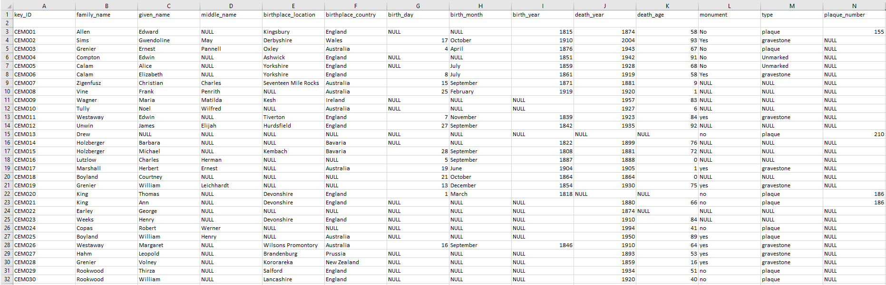
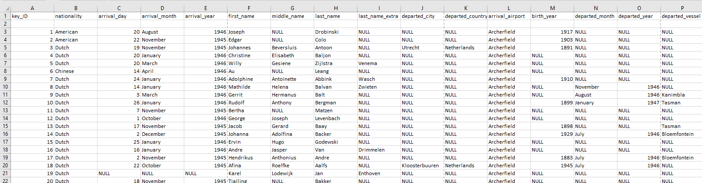

---
---
---

## Task 1 - Data Wrangling

For this task, I created two new tidy datasets based on exploring the different possibilities and limitations such data presented. In the suburb of Archerfield, two distinctively unique entities exist: the airport, and the disused cemetery; consequently, these were the preferred options for exploring datasets.

The first dataset (Figure 1) looked at the God's Acre Cemetery where select interment details were sampled. This sample was partially randomised, with some surnames incorporated on account of their being the names of streets and roads in the immediate vicinity (i.e., Grenier, Boyland, Allen, Compton, and Rookwood). This has been observed by academics. [[1]](#_ftn1)

The source of this dataset was through Australian Cemeteries Index. This dataset was broader than the first one but allowed a few different angles to be approach if being used for a research methodology. First, it lists all names and dates where either relevant, or verifiable, as some dates are unconfirmed (?) afterwards, and in that instance, were recorded as NULL. An additional aspect of this dataset was incorporating monumental information.

Despite its small size and being well maintained and preserved by both the Archerfield Airport Corporation, and historical societies, the cemetery does have multiple unmarked, or unnamed graves, some of which are numbered plaques, added at a later period. In this instance, a grave may have a monument (i.e., a physical, upright, or protruding marker), but no plaque; others may have a plaque only, and nothing else. Any that are a plaque only, without name etcetera, have only a number.

Examining these figures shows the majority of the internees heralding from the British Empire (i.e., England, Wales, Ireland, New Zealand, and Australia) with a minority from the German states. There is also distribution across the time periods of death - ranging from 1880, to 2004, as well as the age distribution. From this small sample, a pattern of aging appears to develop into the late 19th, and 20th centuries; multiple internees exceed the age of sixty years, especially those born in the twentieth century.

The second dataset (Figure 2) is a sampled listing of immigrations into Australia through Archerfield Airport. This was sourced through immigration documents supplied by the National Archives of Australia. Due to the vast number of Dutch representations, I opted to use a small sample. A unique feature of Dutch naming conventions is the patronymic naming convention, leading to four names, rather than the standard three. Consequently, I created four columns explicitly for names, though for the non-Dutch, particularly the Chinese, this resulted in multiple `NULL` entries. As an example dataset it could be used to trace the movements both inbound and outbound, as select passengers did not remain in Australia,
instead leaving on specified vessels.

Due to the large number of Dutch immigrants, a picture outside of their numbers is difficult to obtain. Almost 30% of all Dutch that arrived left within the following 12-18 months, and possibly on Holland-bound vessels on account of their names. Unfortunately, there is some difficulty in properly contextualising the information at hand - departure cities are `NULL` in almost all instances, making it difficult to know if the immigration patterns were out of Holland, or the Dutch East Indies.

[[1]](#_ftnref1) Lucas Tisdell, Yahua Zhang, and Anming Zhang, 'Development challenges facing general aviation airports: a case study of Archerfield Airport, Queensland, Australia', *Case Studies on Transport Policy,* vol. 8, no. 4, 2020, p. 1459.
