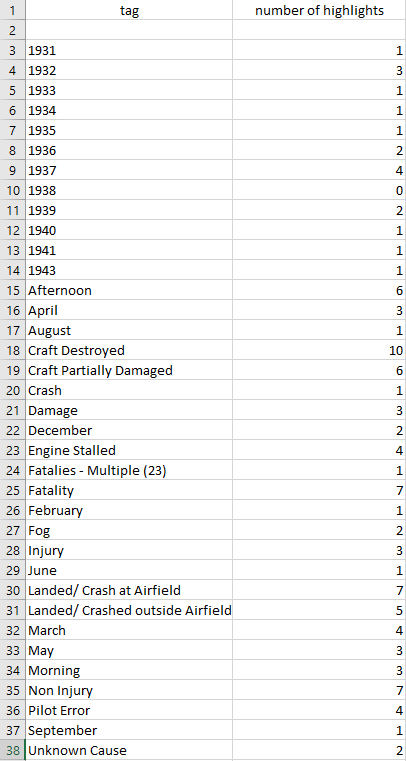

---
---
---

## Task 3 - Thematic Coding

In 1931, Archerfield became the new primary aerodrome for Brisbane, and served in this capacity until 1947, when Eagle Farm Aerodrome was handed over to the Commonwealth by the United States Air Force. [[1]](#_ftn1) As a result, the period between 1931 and 1947 would see air traffic in and around Archerfield increase significantly. The purpose of this coding was to examine newspaper articles during this period and identify all reported instances of crashes involving Archerfield's air activities, and assess the key themes manifested through the articles. By isolating the years 1931-1946 on Trove, instances of crashes were recorded, and analysed through *Taguette* in order to establish key words and concepts. [[2]](#_ftn2) The end result was saved as a `.csv` file and visible as a spreadsheet (Figure 1).

An analysis of the central themes uncovered will follow.

In the period between 1931 and 1946, eighteen instances of crashes were recorded. Across twenty-eight
different reports of these events, pertinent details were recorded, where possible, including factors such as weather, pilot error, the outcome of the aircraft, etcetera. What is revealed is that crashes were more frequent during the 1930s -- peacetime -- than during the wartime period, with 1938 the only exception of having no crashes; otherwise, 1940-1946 only saw three instances. This reduction of incidents during the early 1940s may be, as noted by Tisdell *et al.,* as being a part of the fortification of Brisbane during the war. [[3]](#_ftn3) In fact, the only incident at Archerfield during 1946 was the damage to five planes during a gale, only a handful of weeks before Eagle Farm was set to open as the primary aerodrome. [[4]](#_ftn4)

Statistically, a cursory glance would imply that on average, two people would die each year in crashes. However, further investigation shows this to be an anomaly created by a single, 23-person event in 1943, in which an R.A.A.F plane crashed immediately after takeoff. In fact, this one instance drastically reinterprets the data: fatalities were often rare, with pilots only experiencing injuries approximately 38% of the time, despite the aircraft being destroyed 55% of the time. However, these injuries ranged from minor, to severe:

#### *"The machine was practically wrecked, but Mr. McDonald and his friend escaped with a severe shaking."* [[5]](#_ftn5)

#### *"Barry, the pilot, was not stunned sufficiently to make him unconscious, and though severely burned about the face, neck and arms, as well as suffering bad facial lacerations and shock, he managed to release himself from the safety belt,which was holding him in, and escape from the-inferno, which threatened to destroy him."* [[6]](#_ftn6)

Also, 1937 would convey itself as a standout year for fatalities, with four deaths, but these occurred
across three aircraft in two events; the first being a pilot and passenger dying in a crash, and the second instance the collision of two planes, killing their respective pilots.  

#### *"Giving evidence to-day at an inquest concerning the collision between two aeroplanes at the Archerficld aerodrome on June 19 last, as the result of which Miss Ethel Josephine Clara Tully and Mr. Jack Westlake Barrett were killed, the control officer at Archerfield, Andrew Beitch Lauchland, said that there must certainly have been negligence, but he would not like to ascribe the negligence to any particular pilot."* [[7]](#_ftn7)

Moreover, minor details such as month and time of day help to potentially correlate incidents
with weather, and other factors. Ten crashes occurred in across March, April, and May, with the remainder in Spring and Summer. Winter only recorded one instance of crashing. This could be correlated with fog, though the information on fog is sparse, despite being frequently regarded as one of Archerfield's hindrances as an airfield. [[8]](#_ftn8) Equally, where recorded, incidents occurred in the afternoon twofold to morning events, when fog is at its peak. Lastly, a lack of clarity on the cause of crashes limits thorough interpretation. Almost 50% of all instances were due to either pilot error, or the engine stalling midair, with the remainder either unspecified, or undetermined. 38% of these events occurred at or within the
aerodrome grounds, suggesting difficulties occurred quickly into flight, though this is unconfirmable. The consequences of crashes are sometimes highlighted in detail, as well as the hazard to immediate properties:

#### *"Fouling the ground after the undercarriage of his plane had been torn away and the engine dislodged"* [[9]](#_ftn9)

#### *"... un-able to make the landing was forced down into a paddock near the aero-drome. Evidently striking a stump the plane crumpled up."* [[10]](#_ftn10)

#### *"... flames which shot into the air from where the plane crashed, In the paddock next to Franklin's farmhouse beyond the-fence marking the western boundary of the aerodrome."* [[11]](#_ftn11)

Consequently, because of Trove's consolidation of newspapers, this information could be sorted, analysed, and interpreted, thereby creating new knowledge. [[12]](#_ftn12) However, more than just identifying the instances of crashes at the airfield, patterns emerge in the reduction of crashes during the wartime period. These patterns demonstrate a stark difference during the wartime period when casual flying
would have been limited, but that the aviation industry was still risky, with injuries and craft destruction a considerable possibility.  

[[1]](#_ftnref1) Anon., 'Archerfield', *The Courier Mail,* 22 January 1931, p. 9, c. 6; Anon., 'News in brief', *Truth,* 20 April 1952, p. 4, c. 2.

[[2]](#_ftnref2) D. Archer, 'Data mining and word frequency analysis', in *Research Methods for reading digital data in the digital humanities,* G. Griffin & M. Hayler (eds.), Edinburgh, 2016, p. 78.

[[3]](#_ftnref3) Tisdall *et al.,* 'Development challenges', p. 1459.

[[4]](#_ftnref4) Anon., 'Five airliners wrecked at Archerfield', *Warwick Daily News,* 16 December 1946, p. 1, c. 4.

[[5]](#_ftnref5) Anon., 'Crash of moth plane', *The Daily Mercury,* 18 April, 1932, p. 4.

[[6]](#_ftnref6) Anon., 'Aeroplane crash', *The Telegraph,* 5 September 1932, p. 5.

[[7]](#_ftnref7) Anon., 'Mid air crash', *The Examiner,* 7 July 1937, p. 8.

[[8]](#_ftnref8) Anon, 'Plane crash' *The Telegraph,* 25 July 1932, p. 1; Anon., 'Less fog danger at Eagle Farm', *The Telegraph,* 14 June 1945, p. 5; Anon., 'Heavy fog closes Archerfield', *The Telgraph,* 30 May 1946, p. 1, c. 2.

[[9]](#_ftnref9) Anon., 'Plane crash' *The Telegraph,* 25 July 1932, p. 1.

[[10]](#_ftnref10) *Ibid.*

[[11]](#_ftnref11) *Ibid.*

[[12]](#_ftnref12) E.T. Meyer & R. Schroeder, *Knowledge Machines: Digital Transformations of the Sciences and Humanities,* Cambridge, 2015, p. 6.
